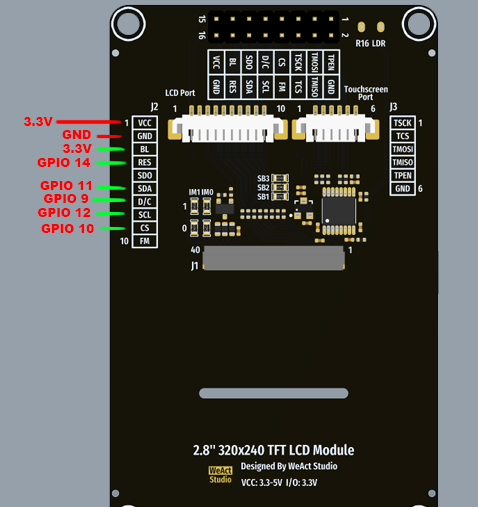

# Offline Map with ESP32-S3

Proyecto embebido que muestra un **mapa sin conexión mediante el ESP32-S3**.
El objetivo de este proyecto es proporcionar una forma ligera y económica de visualizar mapas **sin necesidad de conexión a internet**.

El sistema carga los mosaicos del mapa almacenados localmente y los muestra en una pantalla conectada al ESP32-S3.


Original Source: https://github.com/gmlonghini/map-viewer-offline-esp32s3

---

## Caracterísrticas

- Visualización de mapas totalmente sin conexión
- Desarrollado con **ESP32-S3**
- Los mosaicos del mapa se almacenan en **memoria flash local / sistema de archivos**
- Renderizado fluido de los mosaicos
- Hardware de bajo costo

---

## Hardware

- ESP32-S3 N16R8 16MB Flash 8MB PSRAM.
- 2.8" 320x240 TFT LCD Module ST7789 Driver.
- x4 push buttons para navegación.
- x4 1k/10K resistencias

## Conexiones del Display a Pines GPIO del ESP32S3 



```
// VCC -> 3.3V
// BL -> 3.3v
#define PIN_MOSI 11  //(SDA Pin)
#define PIN_SCLK 12 // (SLC Pin)
#define PIN_CS 10   // (CS Pin)
#define PIN_DC 9   // (D/C Pin)
#define PIN_RST 14 // (RES Pin)
```
Push Buttons:

```
#define BTN1_GPIO 4 // Navegar para arriba.
#define BTN2_GPIO 5 // Navegar para abajo.
#define BTN3_GPIO 6 // Navegar a la derecha.
#define BTN4_GPIO 7 // Navegar a la izquierda.
```

## Descargar imagenes OpenStreetMap

1. Abrir script "map_downloader.py" que se encuentra en la carpeta "scripts".
2. Actualizar variable center_lat y center_lon con las coordenadas del área a descargar imagenes del mapa OpenStreetMap.

- Web recomendada para obtener coordenadas: https://www.mapcoordinates.net/

3. Luego de descargar las imagenes en formato ".rgb565" copiarlas a la carpeta "spiffs_data".
* Recordar descomentar la linea de codigo:

```
#spiffs_create_partition_image(storage ../spiffs_data FLASH_IN_PROJECT)
```
Qué esta dentro del archivo "CMakeLists.txt".

4. Actualizar linea de codigo en el archivo "main.c": 
```
map_view_create(scr, 16, 24278, 37181);

// La función map_view_create(scr, 16, 24278, 37181) recibe:

zoom = 16
start_tile_x = 24278
start_tile_y = 37181
```
* Actualiza esos valores usando la calculador "tiles_calculator.html" que se encuentra dentro de la carpeta "scripts".
Guía en vídeo: https://youtu.be/kzpb6G0wuQw

## Menuconfig ESP-IDF.

1. Abrir terminal ESP-IDF.
2. Correr comando: idf.py menuconfig
3. Aplicar configuraciones segun la guía "menuconfig.pdf" que esta dentro de la carpeta "docs".

## Software

- ESP-IDF 5.5.4/v5.3.0 o superior.
- C language
- SPIFFS or FAT filesystem for map storage

## Agradecimientos/Créditos
- @gmlonghini (https://github.com/gmlonghini/map-viewer-offline-esp32s3/tree/main)